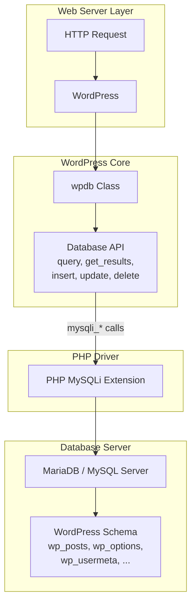
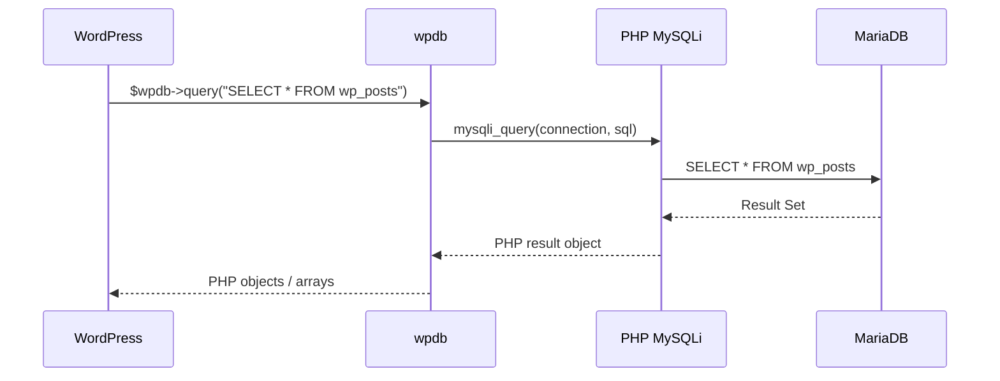
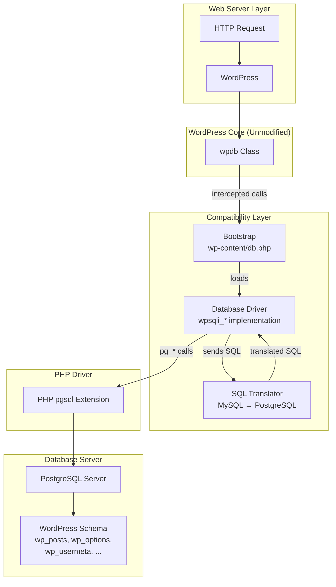
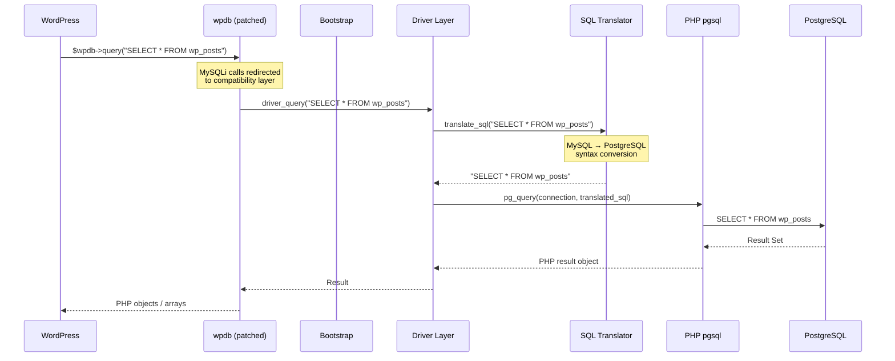
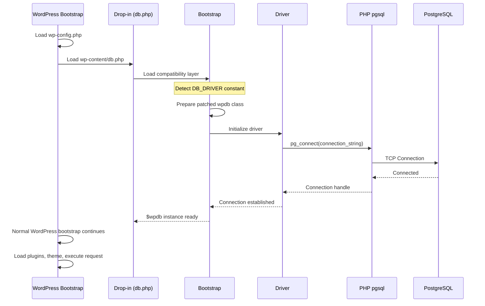
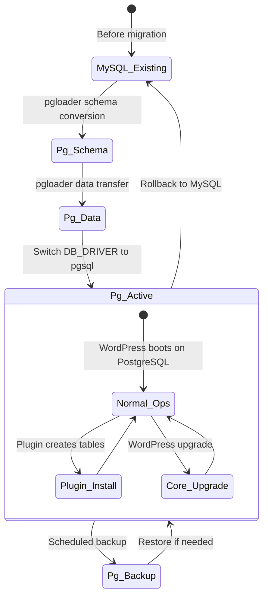

# Architecture: PostgreSQL Backend for WordPress

**Version**: 3.0  
**Status**: Draft  
**Last Updated**: 2026-07-02  
**Purpose**: Document the current and target architectures — not requirements, but architectural context

---

## 1. Current Architecture (MariaDB/MySQL)

### 1.1 Component Diagram



### 1.2 Request Flow (MariaDB)



---

## 2. Target Architecture (PostgreSQL via PG4WP)

### 2.1 Component Diagram



### 2.2 Deployment Diagram

```mermaid
graph TB
    subgraph "Web Server"
        FS[File System<br/>WordPress + PG4WP files]
        PHP_RT[PHP Runtime<br/>8.1 - 8.4]
        PHP_PG[PHP pgsql Extension]
    end

    subgraph "Database Server"
        PG[PostgreSQL Server<br/>14 - 17]
        WP_DB[(WordPress Database)]
    end

    subgraph "Administration"
        WPCLI[WP-CLI]
        PG_TOOLS[PostgreSQL Tools<br/>psql, pg_dump, pg_restore]
        MIGRATION[pgloader<br/>Migration Tool]
    end

    PHP_PG -->|pg_connect()| PG
    FS --> PHP_RT
    PHP_RT --> PHP_PG
    MIGRATION -->|MySQL → PostgreSQL| PG
    WPCLI --> PHP_RT
    PG_TOOLS --> PG
```

### 2.3 Request Flow (PostgreSQL)



### 2.4 Startup Sequence



### 2.5 Database Schema Lifecycle



---

## 3. Architectural Considerations

### 3.1 WordPress Drop-in Plugin Architecture

WordPress's `wp-settings.php` automatically loads `wp-content/db.php` if it exists, allowing the database driver and connection to be replaced before any WordPress code uses the database. This is the architectural hook that enables the compatibility layer without core modifications.

### 3.2 Runtime wpdb Patching

The compatibility layer reads the WordPress core file `class-wpdb.php`, applies string replacements to redirect all MySQLi function calls to compatibility equivalents, and evaluates the result in memory. This produces a patched runtime class without modifying the files on disk.

**Risks**: The patching is sensitive to formatting changes in `class-wpdb.php`. See ADR-002 for detailed analysis.

### 3.3 Statement-Type Translation Factory

SQL translation follows a delegation pattern:
1. The raw SQL string is classified by statement type (SELECT, INSERT, etc.) using pattern matching
2. A type-specific translator performs the MySQL-to-PostgreSQL conversion
3. Global post-processing normalizes quoting, capitalization, and edge cases

**Benefit**: Each SQL statement type has an isolated translator, making them independently testable and maintainable.

### 3.4 Stub-Based Translation Verification

Translations are verified using input/output pairs: a MySQL SQL string and its expected PostgreSQL equivalent. Tests run without a database, enabling fast, comprehensive regression coverage.

### 3.5 State Management

The compatibility layer maintains request-scoped state in globally accessible variables:
- The current result set from the last query
- Metadata about the last INSERT (table name, field name) for insert ID retrieval
- A cached count query for pagination support
- Connection error state

**Risk**: State shared across operations within a single request must be carefully managed. See ADR-007.

---

## 4. Architectural Constraints

| Constraint | Source | Rationale |
|-----------|--------|-----------|
| No WordPress core file modifications | Project principle | Maintains upgrade compatibility |
| All compatibility code in `wp-content/` | WordPress convention | Clean isolation, easy enable/disable, standard drop-in mechanism |
| Translation must be stateless except for explicitly documented operations | Scalability | Prevents cross-query interference under concurrent requests |
| Errors must propagate through standard WordPress channels | Observability | Debugging tools and plugins must work unchanged |
| Must support standard deployment topologies | Portability | Single server, load-balanced, containerized |

---

## 5. Component Interaction Matrix

| Component | Interacts With | Interface | Data Format |
|-----------|---------------|-----------|-------------|
| WordPress Core | Compatibility layer (via patched wpdb) | PHP function calls | PHP scalars, arrays, objects |
| Compatibility Driver | PHP pgsql extension | PHP function calls | PHP scalars, connection handles |
| SQL Translator | Compatibility Driver | PHP function calls | SQL strings |
| PHP pgsql | PostgreSQL server | PostgreSQL wire protocol (TCP 5432) | Binary/text protocol |
| Logging subsystem | File system | File write | Text log entries |

---

### Checklist

- [x] Current architecture documented with component diagram
- [x] Target architecture documented with component diagram
- [x] Deployment diagram for target architecture
- [x] Request flow diagrams for both architectures
- [x] Startup sequence diagram
- [x] Schema lifecycle diagram
- [x] Architectural considerations documented (not requirements)
- [x] Architectural constraints documented
- [x] Component interaction matrix documented
- [x] No implementation-specific internal APIs exposed at the specification level
