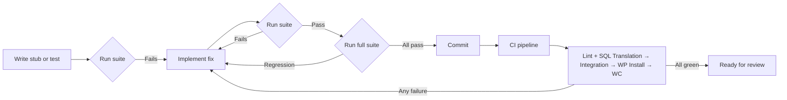

# Testing Specification: PostgreSQL Backend for WordPress

**Version**: 3.0  
**Status**: Draft  
**Last Updated**: 2026-07-02

---

## 1. Testing Approach

Testing follows a layered pyramid approach where lower layers are fast, cheap, and run on every commit, while higher layers are slower, more expensive, and run in CI.

### Test Layers

```
        /\          Manual / Exploratory
       /  \         ──────────────────────
      /    \        Acceptance Tests (full WordPress + PostgreSQL)
     /      \       ──────────────────────
    /        \      Integration Tests (live PostgreSQL)
   /          \     ──────────────────────
  /            \    SQL Translation Tests (no database)
 /______________\   ──────────────────────
/  Unit Tests    \  PHP function-level tests
──────────────────  ──────────────────────
```

---

## 2. Test Categories

### 2.1 Unit Tests (TS-01)

**Purpose**: Verify individual PHP functions in isolation.

**Methodology**: PHPUnit tests that test helper functions, string manipulation, type detection, and other isolated logic.

| Area | What Is Tested | Frequency |
|------|---------------|-----------|
| SQL type detection | Statement type classification from raw SQL | Every commit |
| String escaping | Quote handling, escape character conversion | Every commit |
| Type mapping | MySQL-to-PostgreSQL type name conversion | Every commit |
| Identifier quoting | Backtick-to-double-quote conversion | Every commit |

**Tools**: PHPUnit (version-appropriate phar for PHP 8.1-8.4)

**Success Criteria**: 100% pass rate

---

### 2.2 SQL Translation Tests (TS-02)

**Purpose**: Verify that MySQL SQL input produces correct PostgreSQL output. These are the fastest and most numerous tests.

**Methodology**: Each test case is a JSON fixture pair:
```json
{"mysql": "SELECT * FROM wp_posts WHERE ID = 1",
 "postgresql": "SELECT * FROM wp_posts WHERE \"ID\" = 1"}
```

Tests run without a database connection. They verify string output only.

**Test Coverage**:

| Category | Sub-Categories | Target Stub Count |
|----------|----------------|-------------------|
| SELECT | Basic, DISTINCT, GROUP BY, HAVING, WHERE, JOIN, subquery, UNION, LIMIT/OFFSET, FOUND_ROWS, SQL_CALC_FOUND_ROWS | 250+ |
| SELECT functions | YEAR, MONTH, RAND, FIELD, GROUP_CONCAT, IF, DATE_ADD, UNIX_TIMESTAMP, REGEXP, LIKE/ILIKE, CONCAT, CAST, IFNULL, COALESCE, UTC_TIMESTAMP | 100+ |
| INSERT | Standard, multi-row, INSERT...SET, INSERT IGNORE, ON DUPLICATE KEY, REPLACE INTO | 60+ |
| UPDATE | Standard, with JOIN, with LIMIT | 40+ |
| DELETE | Standard, multi-table, with JOIN, with LIMIT | 40+ |
| DDL (CREATE TABLE) | All type variants, AUTO_INCREMENT, ENUM, BINARY, UNSIGNED, KEY/INDEX, CHARACTER SET, ENGINE | 80+ |
| DDL (ALTER TABLE) | ADD/DROP/CHANGE COLUMN, ADD/DROP INDEX, ALTER COLUMN DEFAULT | 30+ |
| DDL (DROP TABLE) | Standard, IF EXISTS, CASCADE | 15+ |
| Schema introspection | SHOW TABLES, SHOW COLUMNS, SHOW INDEX, SHOW VARIABLES, DESCRIBE, SHOW TABLE STATUS | 40+ |
| Edge cases | NULL handling, empty strings, zero dates, type boundaries, deeply nested parentheses, string literals with special characters | 50+ |
| Error conditions | SQL that cannot be translated, malformed input | 10+ |

**Runner**: `php tests/tools/run-tests.php tests/`

**Success Criteria**: 100% of stubs produce expected PostgreSQL output

---

### 2.3 Integration Tests (TS-03)

**Purpose**: Verify that driver functions work correctly against a live PostgreSQL instance.

**Methodology**: Automated tests run against a temporary PostgreSQL database.

| Test Group | Functions Tested | Verification |
|------------|-----------------|-------------|
| Connection | Connect, disconnect, ping, SSL options | Connection succeeds with valid credentials, fails with invalid |
| Query execution | Execute SELECT, INSERT, UPDATE, DELETE | Correct data returned, affected rows accurate |
| Result fetching | Fetch assoc, array, row, object, all | Correct data types and values |
| Prepared statements | Prepare, bind param, execute, fetch | Statement lifecycle completes correctly |
| Transactions | BEGIN, COMMIT, ROLLBACK, autocommit | Transaction boundaries respected |
| Error handling | Query errors, connection errors | Correct error codes returned through WordPress channels |
| Metadata | Field count, affected rows, insert ID | Values match expected |
| Multi-query | Multiple statements, result iteration | Sequential execution works |
| Connection string | Host, port, socket, SSL parameters | All formats parse correctly |
| Character encoding | Connection charset setting | UTF-8 data stored and retrieved correctly |

**Environment**: Live PostgreSQL 14-17, PHP 8.1-8.4

**Success Criteria**: All integration tests pass on all target PostgreSQL versions

---

### 2.4 WordPress Installation Tests (TS-04)

**Purpose**: Verify that WordPress installs and operates correctly on PostgreSQL.

**Methodology**: Full WordPress installation via WP-CLI on a PostgreSQL database, followed by functional tests.

| Test | What Is Verified |
|------|------------------|
| WordPress installation | `wp core install` completes, tables created, admin user exists |
| Database schema | All standard WordPress tables exist with correct structure |
| Admin dashboard | Admin pages load without errors |
| Front-end rendering | Site renders, posts display |
| Plugin activation | A standard plugin activates without errors |
| Theme activation | A standard theme activates without errors |

**Environment**: WordPress 6.4+, PostgreSQL 16, PHP 8.2

**Success Criteria**: All installation tests pass

---

### 2.5 Migration Tests (TS-05)

**Purpose**: Verify that migration from MySQL to PostgreSQL transfers data correctly.

**Methodology**: Create a MySQL database with representative WordPress data, migrate using pgloader, verify on PostgreSQL.

| Test | What Is Verified |
|------|------------------|
| Schema migration | All tables, indexes, constraints created in PostgreSQL |
| Data migration | Row counts match, data values match |
| Serialized data | PHP serialized strings preserved byte-for-byte |
| Sequence values | Auto-increment starting values set correctly |
| Character encoding | UTF-8 multi-byte characters preserved |
| Migration report | pgloader reports zero errors |

**Success Criteria**: Data integrity verified, zero migration errors

---

### 2.6 Regression Tests (TS-06)

**Purpose**: Ensure that changes do not break previously working functionality.

**Methodology**: Every bug fix must include a test that demonstrates the bug before the fix and passes after.

**Process**:
1. Before fix: Write stub demonstrating the bug
2. Verify stub fails (Red phase)
3. Apply fix
4. Verify stub passes (Green phase)
5. Verify no other stubs regressed

**Success Criteria**: 100% of regression stubs pass; zero regressions in existing stubs

---

### 2.7 Performance Tests (TS-07)

**Purpose**: Verify that performance metrics meet targets.

| Test | Measurement | Target |
|------|-------------|--------|
| Page load benchmark | Load WordPress front-end and admin pages | < 120% of MySQL baseline |
| SQL translation microbenchmark | Time to translate 1,000 representative queries | < 5 ms average |
| Connection time comparison | Time to establish PostgreSQL vs MySQL connection | < 2x MySQL connection time |
| Concurrent request test | 10 simultaneous requests | No errors, comparable throughput |
| Test suite execution time | Full test suite | < 5 seconds |

**Success Criteria**: All performance metrics within documented targets

---

### 2.8 Compatibility Tests (TS-08)

**Purpose**: Verify compatibility with specific plugins and themes.

| Test | What Is Verified |
|------|------------------|
| WooCommerce product CRUD | Products created, read, updated, deleted |
| WooCommerce order lifecycle | Orders created, status transitions, emails |
| WooCommerce cart/checkout | Cart operations, checkout flow |
| WooCommerce REST API | Product and order API endpoints |
| WooCommerce analytics | Report queries execute without error |
| Plugin compatibility matrix | Each listed plugin activates and functions |
| Multisite operations | Site creation, deletion, content isolation |

**Success Criteria**: All compatibility tests pass for supported plugin/theme versions

---

## 3. Requirement-to-Test Mapping

| Requirement | Unit (TS-01) | SQL Translation (TS-02) | Integration (TS-03) | Installation (TS-04) | Migration (TS-05) | Performance (TS-07) | Compatibility (TS-08) |
|-------------|:---:|:---:|:---:|:---:|:---:|:---:|:---:|
| FR-01 | — | — | — | ✓ | — | — | — |
| FR-02 | — | DDL stubs | — | ✓ | ✓ | — | — |
| FR-03 | — | — | ✓ | ✓ | — | — | — |
| FR-04 | — | — | — | ✓ | — | — | — |
| FR-05 | — | All DML stubs | ✓ | ✓ | — | — | — |
| FR-06 | — | Comment stubs | ✓ | ✓ | — | — | — |
| FR-07 | — | User stubs | ✓ | ✓ | — | — | — |
| FR-08 | — | Term stubs | ✓ | ✓ | — | — | — |
| FR-09 | — | Meta stubs | ✓ | ✓ | — | — | — |
| FR-10 | — | Media stubs | ✓ | ✓ | — | — | — |
| FR-11 | — | YEAR/MONTH stubs | ✓ | ✓ | — | — | — |
| FR-12 | — | Plugin DDL stubs | ✓ | — | — | — | ✓ |
| FR-13 | — | Theme DDL stubs | — | — | — | — | ✓ |
| FR-14 | — | All plugin SQL stubs | ✓ | — | — | — | ✓ |
| FR-15 | — | — | ✓ | ✓ | ✓ | — | — |
| FR-16 | — | — | ✓ | — | ✓ | — | — |
| FR-17 | — | REST API stubs | ✓ | ✓ | — | — | — |
| FR-18 | — | Complex query stubs | ✓ | ✓ | — | — | — |
| FR-19 | — | — | ✓ | ✓ | — | — | — |
| FR-20 | — | CLI SQL stubs | ✓ | ✓ | — | — | — |
| FR-21 | — | Maintenance stubs | ✓ | ✓ | — | — | — |
| FR-22 | — | Cron stubs | ✓ | ✓ | — | — | — |
| FR-23 | — | — | — | — | ✓ | — | — |
| FR-24 | — | Serialized data stubs | — | — | ✓ | — | — |
| FR-25 | — | — | ✓ | — | ✓ | — | — |
| FR-26 | — | — | — | — | ✓ | — | — |
| FR-27 | — | INSERT stubs | ✓ | — | — | — | — |
| FR-28 | — | Multisite stubs | ✓ | ✓ | — | — | — |
| FR-29 | — | WC product stubs | ✓ | — | — | — | ✓ |
| FR-30 | — | WC order stubs | ✓ | — | — | — | ✓ |
| FR-31 | — | WC cart stubs | ✓ | — | — | — | ✓ |
| FR-32 | — | WC API stubs | ✓ | — | — | — | ✓ |
| FR-33 | — | — | ✓ | — | — | — | — |
| NFR-01 | — | — | — | — | — | ✓ | — |
| NFR-02 | — | ✓ | — | — | — | ✓ | — |
| NFR-03 | — | — | ✓ | — | — | ✓ | — |
| NFR-04 | — | — | — | — | — | ✓ | — |
| NFR-05 | — | ✓ | ✓ | ✓ | ✓ | — | — |
| NFR-06 | — | ✓ | — | — | — | — | — |
| NFR-07 | — | — | ✓ | — | — | — | — |
| NFR-08 | — | — | ✓ | ✓ | — | — | — |
| NFR-09 | — | — | — | — | — | — | — |
| NFR-10 | — | — | — | ✓ | — | — | — |
| NFR-11 | — | — | — | — | — | ✓ | — |
| NFR-12 | — | — | — | — | — | — | ✓ |
| NFR-13 | — | ✓ | ✓ | — | — | — | — |
| NFR-14 | — | — | ✓ | — | — | — | — |
| NFR-15 | — | — | ✓ | ✓ | — | — | — |
| NFR-16 | — | — | ✓ | — | — | — | — |
| NFR-17 | — | — | — | ✓ | — | — | — |
| NFR-18 | — | — | — | ✓ | — | — | — |
| NFR-19 | — | — | ✓ | — | — | — | — |
| NFR-20 | — | — | ✓ | — | — | — | — |
| NFR-21 | — | — | ✓ | — | — | — | — |
| NFR-22 | — | — | ✓ | ✓ | — | — | — |
| NFR-23 | — | — | — | — | ✓ | — | — |
| NFR-24 | — | — | ✓ | — | — | — | — |
| SEC-01 | — | — | ✓ | — | — | — | — |
| SEC-02 | — | — | ✓ | — | — | — | — |
| SEC-03 | ✓ | — | — | — | — | — | — |
| SEC-04 | — | — | ✓ | — | — | — | — |
| SEC-05 | — | — | ✓ | — | — | — | — |
| SEC-06 | — | — | ✓ | — | — | — | — |
| SEC-07 | — | — | ✓ | — | — | — | — |
| SEC-08 | — | ✓ | ✓ | — | — | — | — |
| SEC-09 | — | — | ✓ | — | — | — | — |
| SEC-10 | — | — | ✓ | — | — | — | — |
| SEC-11 | — | — | ✓ | — | — | — | — |
| SEC-12 | — | — | — | — | — | — | — |
| SEC-13 | — | — | — | — | — | — | — |
| SEC-14 | — | — | — | — | — | — | — |

---

## 4. CI Pipeline Configuration

| Pipeline Stage | Tests Run | Frequency | Environment |
|----------------|-----------|-----------|-------------|
| Lint | PHP syntax check on all source files | Every commit | PHP 8.1-8.4 |
| SQL Translation | Full stub suite (TS-02) | Every commit | PHP 8.1-8.4 |
| Integration | Driver tests against live PG (TS-03) | Every commit | PHP 8.1/8.3 × PG 14/15/16/17 |
| WordPress Install | Full WordPress install + operations (TS-04) | Every commit | PHP 8.1-8.3 × WP 6.4-6.6+ × PG 16 |
| WooCommerce | WooCommerce install + operations (TS-08) | Every commit | PHP 8.2 × WP 6.5+ × WC 8.9+ × PG 16 |
| Performance | Benchmark suite (TS-07) | Scheduled (weekly) | Production-like environment |

---

## 5. Test Data Requirements

| Test Type | Database Required | Data Volume | Setup |
|-----------|------------------|-------------|-------|
| SQL Translation (TS-02) | No | N/A | None |
| Integration (TS-03) | Yes (live PG) | Minimal schema | Automated |
| Installation (TS-04) | Yes (live PG) | Full WordPress DB | Automated via WP-CLI |
| Migration (TS-05) | Yes (both MySQL and PG) | Representative data set | Imported from fixture |
| Performance (TS-07) | Yes (both MySQL and PG) | Production scale | Restored from anonymized backup |
| Compatibility (TS-08) | Yes (live PG) | Full WordPress + WooCommerce DB | Automated via WP-CLI |

---

## 6. Test Execution Workflow



---

### Checklist

- [x] Unit tests defined
- [x] SQL translation tests defined with coverage targets
- [x] Integration tests defined
- [x] Installation tests defined
- [x] Migration tests defined
- [x] Regression test process documented
- [x] Performance tests defined with targets
- [x] Compatibility tests defined
- [x] Every functional requirement maps to at least one test
- [x] Non-functional requirements map to tests
- [x] Security requirements map to tests
- [x] CI pipeline stages defined
- [x] Test data requirements documented
- [x] Test execution workflow documented
